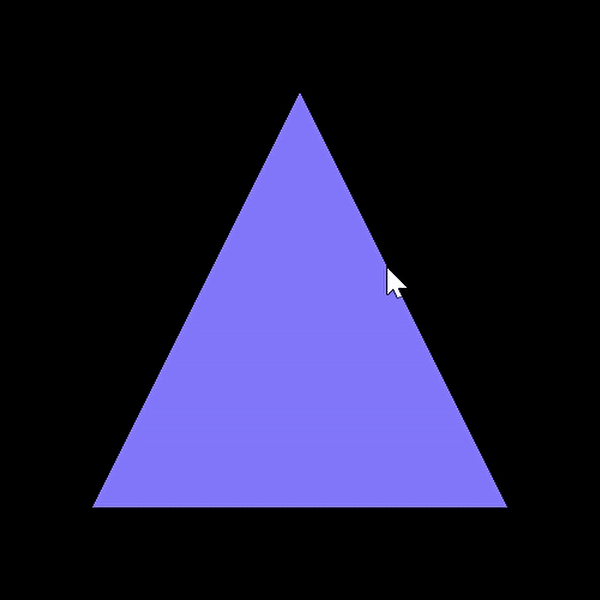

# mesh-viewer

OPenGL applications for viewing meshes

## Simple-Mesh Demo
Features implemented:
- Dragging with the left mouse button down rotates the camera around the origin 
- SHIFT+Drag with the left mouse button down moves the camera towards and away from the origin
- Mesh class that loads PLY files




## How to build

*Windows*

Open git bash to the directory containing this repository.

```
mesh-viewer $ mkdir build
mesh-viewer $ cd build
mesh-viewer/build $ cmake -G "Visual Studio 16 2019" ..
mesh-viewer/build $ start CS312-MeshViewer.sln
```

Your solution file should contain multiple projects, such as `mesh-viewer`.
To run from the git bash command shell, 

```
mesh-viewer/build $ ../bin/Debug/mesh-viewer
```

*macOS*

Open terminal to the directory containing this repository.

```
mesh-viewer $ mkdir build
mesh-viewer $ cd build
mesh-viewer/build $ cmake ..
mesh-viewer/build $ make
```

To run each program from build, you would type

```
mesh-viewer/build $ ../bin/mesh-viewer
```


